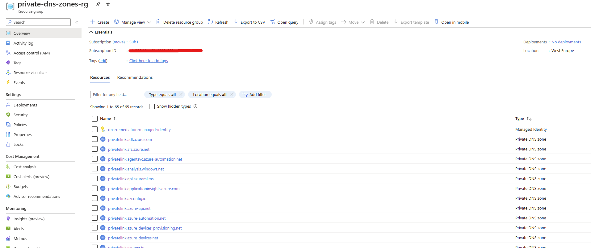
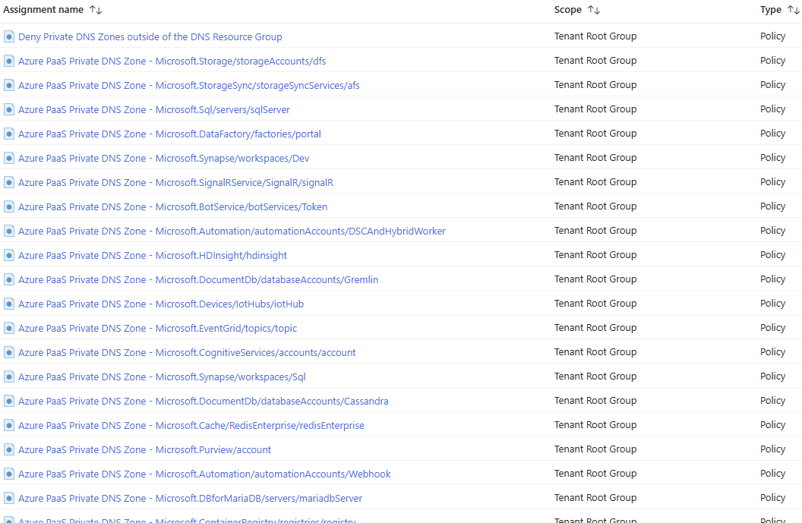

# Azure Private Endpoint DNS integration

# Overview
The challenge with Privte Endpoint is clearly the DNS integration and configuration. 
It's important to correctly configure the DNS to resolve the endpoint name with the private IP address.

Existing Microsoft Azure services might already have a DNS configuration for a public endpoint. This configuration must be overridden to connect using private endpoint.

The network interface associated with the private endpoint contains the information to configure DNS. The network interface information includes FQDN and private IP addresses for the private link resource.

# Azure services DNS zone configuration
Azure creates a canonical name DNS record (CNAME) on the public DNS. The CNAME record redirects the resolution to the private domain name. You can override the resolution with the private IP address of your private endpoints.

# Implementation
## Terraform deployment
### Requirements
You will need to install : 
* [Terraform](https://www.terraform.io/downloads.html) (tested with version v1.4.6)
* Terraform Providers (installed using command *terraform init*): 
  * azurerm (tested with version v3.56.0)
  * random (tested with version v3.5.1)

### Quickstart
You can review and edit the mapping in file : private-zones.json and customize options in file : variables.tf
Once everything is ready, you just have to start terraform deployment : 
````
> terraform init
> terraform plan
> terraform apply
````
After severals minutes, everything must be deployed: 


You will have one dedicated Ressource Group for Private DNS Zone: 


If you check on [Policy Assignments](https://portal.azure.com/#view/Microsoft_Azure_Policy/PolicyMenuBlade/~/Assignments) you must have all the assignments done for all the type of private endpoint: 


## Manual configuration
You can use deploy-policy.json file to create a new policy definition using Azure portal or CLI : 
```
az policy definition create --name 'AzurePaaSPrivateDNSZone' --rules "`jq '.[].policyRule' deploy-policy.json`" --params "`jq '.[].parameters' deploy-policy.json`"
```

You have to create in advance the Private DNS Zone corresponding to the type of private endpoint you want to manage with the policy. 

You can create one assignement for each type of private endpoint (privateLinkResourceType / subresource). For example if you want to manage Storage Account blob private endpoint : 
```
az policy assignment create --name 'private-dns-storageAccounts-blob' --policy 'AzurePaaSPrivateDNSZone' --mi-system-assigned --location westeurope --params '{"privateDnsZoneIds": {"value": [  "/subscriptions/00000000-0000-0000-0000-000000000000/resourceGroups/private-dns-zones-rg/providers/Microsoft.Network/privateDnsZones/privatelink.blob.core.windows.net"]},"privateEndpointGroupId": {"value": "blob"},"privateEndpointPrivateLinkServiceId": {"value": "Microsoft.Storage/storageAccounts"}}'
```

If you want to deny the creation of private DNS zone, you can use the deny policy using provided definition : 
```
az policy definition create --name 'DenyPrivateDNSZones' --rules "`jq '.properties.policyRule' deny-policy.json`" --params "`jq '.properties.parameters' deny-policy.json`"
az policy assignment create --name 'deny-private-dns-zone' --policy 'DenyPrivateDNSZones'

```

